# Compliance Data Platform - Architecture Diagrams

This document contains visual architecture diagrams in Mermaid format that can be rendered in Markdown viewers that support Mermaid (GitHub, GitLab, many documentation tools).

## System Overview


## Data Aggregation Pipeline


## Request Flow - Allocator Compliance


## Aggregation Job Flow


## Report Generation Flow


## Component Architecture


## Database Architecture

```mermaid
erDiagram
    DMOB_DB ||--o{ unified_verified_deal : contains
    DMOB_DB ||--o{ verified_client_allowance : contains
    DMOB_DB ||--o{ verified_client : contains
    
    unified_verified_deal_hourly ||--o{ providers_weekly : feeds
    unified_verified_deal_hourly ||--o{ client_provider_distribution_weekly : feeds
    unified_verified_deal_hourly ||--o{ client_claims_hourly : feeds
    
    client_provider_distribution_weekly ||--o{ providers_weekly : feeds
    client_allocator_distribution_weekly ||--o{ allocators_weekly : feeds
    
    providers_weekly ||--o{ allocators_weekly_acc : feeds
    allocators_weekly ||--o{ allocators_weekly_acc : feeds
    
    provider_retrievability_daily ||--o{ providers_weekly : feeds
    
    unified_verified_deal : has
    verified_client_allowance : has
    verified_client : has
    
    unified_verified_deal_hourly : aggregates
    client_provider_distribution_weekly : aggregates
    client_allocator_distribution_weekly : aggregates
    providers_weekly : aggregates
    allocators_weekly : aggregates
    allocators_weekly_acc : accumulates
```

## Job Scheduling Architecture

```mermaid
gantt
    title Aggregation and Report Job Schedule
    dateFormat HH:mm
    axisFormat %H:%M
    
    section Hourly Jobs
    Aggregation Tasks    :active, agg, 00:00, 1h
    Aggregation Tasks    :agg2, after agg, 1h
    Aggregation Tasks    :agg3, after agg2, 1h
    
    section Daily Jobs
    Allocator Reports    :crit, report, 06:00, 2h
    IPNI Fetcher         :ipni, 08:00, 1h
    
    section Weekly Jobs
    Weekly Aggregations  :weekly, 00:00, 4h
```



## Error Handling Flow


## Cache Flow


## Monitoring Architecture

```mermaid
graph TB
    subgraph Application["Application"]
        API[API Endpoints]
        Services[Services]
        Jobs[Background Jobs]
    end
    
    subgraph Metrics["Metrics Collection"]
        Prometheus[Prometheus Client]
        CustomMetrics[Custom Metrics]
        HealthMetrics[Health Metrics]
    end
    
    subgraph Export["Metrics Export"]
        MetricsEndpoint[/metrics endpoint]
        HealthEndpoint[/health endpoint]
    end
    
    subgraph Monitoring["Monitoring Stack"]
        PrometheusServer[Prometheus Server]
        Grafana[Grafana Dashboards]
        Alerts[Alert Manager]
    end
    
    API --> Prometheus
    Services --> Prometheus
    Jobs --> Prometheus
    Prometheus --> CustomMetrics
    Prometheus --> HealthMetrics
    
    CustomMetrics --> MetricsEndpoint
    HealthMetrics --> HealthEndpoint
    
    MetricsEndpoint --> PrometheusServer
    HealthEndpoint --> PrometheusServer
    PrometheusServer --> Grafana
    PrometheusServer --> Alerts
    
    style Application fill:#e1f5ff
    style Metrics fill:#fff4e1
    style Export fill:#e8f5e9
    style Monitoring fill:#f3e5f5
```

## Deployment Architecture


## State Machine - Aggregation Job


## Data Flow - Compliance Score Calculation


