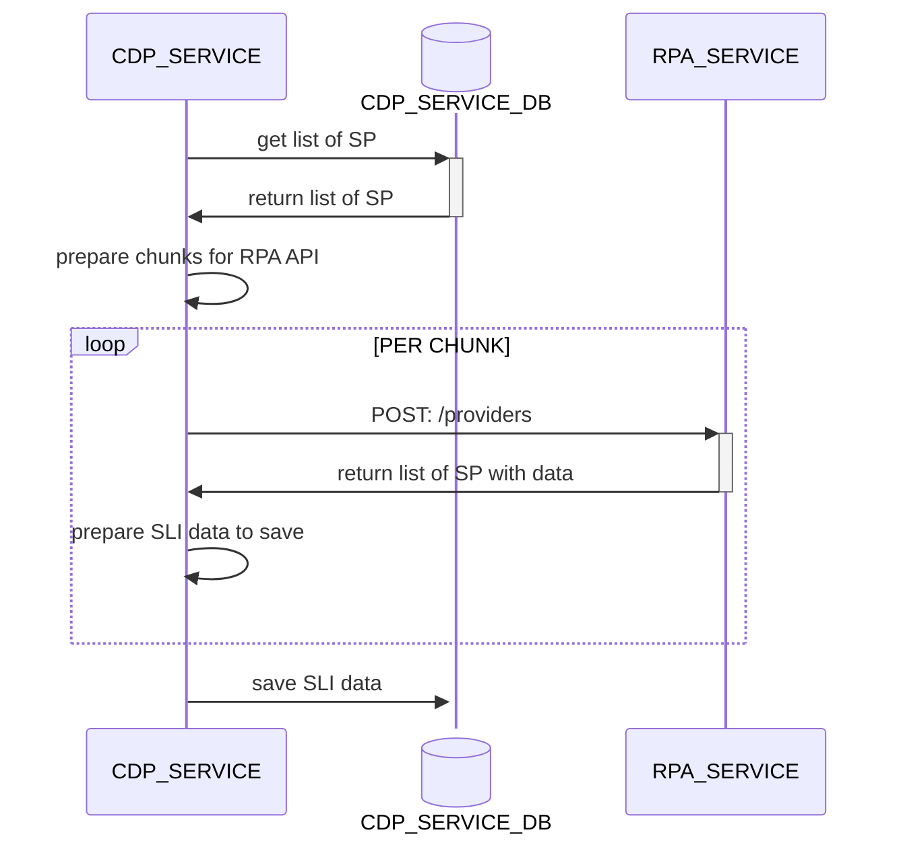

# SLI - Exposing

## Overview

This Compliance Data Platform (CDP) collects and exposes Service Level Indicators (SLIs) about Storage Providers (SP) measured by Bandwidth Measure System (BMS) and managed by RPA services.

---

## Collecting SLI - Architecture



---

## Available SLIs

List all Service Level Indicators.

### TTFB

- Name: TTFB
- Description: Time from sending an HTTP GET (typically a Range request) until the first byte of the response body is received.
- Unit: `ms`

---

### RPA_RETRIEVABILITY

- Name: RPA Retrievability
- Description: Percentage of tested URLs that respond successfully to the HEAD request over the sampled PieceCIDs.
- Unit: `%`

---

### BANDWIDTH

- Name: Bandwidth
- Description: Observed aggregate throughput during parallel downloads by N workers for a fixed byte-range and synchronized time window.
- Unit: `Mbps`

---

### CAR_FILES

- Name: CAR files Retrievability
- Description: CAR files retrievability percentage
- Unit: `%`

---

### IPNI_REPORTING

- Name: IPNI Reporting
- Description: Percentage of days in the last month on which the storage provider successfully reported to IPNI
- Unit: `%`

---

## Metrics Exposure

- Endpoint: `GET storage-providers/average-monthly-sli`
- Format: `JSON`
- Example:

```
 curl -X 'GET' 'https://cdp.allocator.tech/storage-providers/average-monthly-sli?storageProvidersIds=f03623017&storageProvidersIds=f03644168' -H 'accept: application/json'
```
